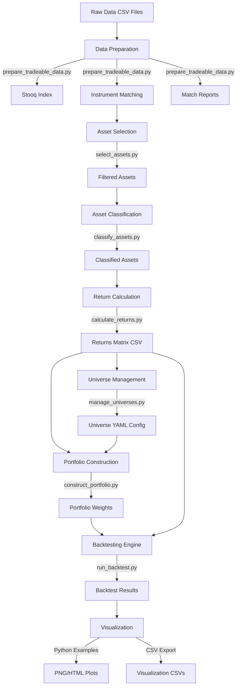

# Documentation and Cleanup Plan

**Date**: October 25, 2025
**Status**: In Progress
**Goal**: Make portfolio_management repository production-ready with comprehensive documentation

______________________________________________________________________

## Current State Analysis

### Root Directory Issues (36 Markdown Files!)

The root directory contains many legacy summary/sprint files that should be archived:

**Files to Archive** (move to `archive/documentation/`):

- BENCHMARK_QUICK_START.md
- CACHE_BENCHMARK_IMPLEMENTATION.md
- CACHING_EDGE_CASES_SUMMARY.md
- CARDINALITY_IMPLEMENTATION_SUMMARY.md
- CLEANUP_AND_WORKFLOW_SUMMARY.md
- CLEANUP_SUMMARY_2025-10-23.md
- CODEBASE_CLEANUP_ANALYSIS.md
- EDGE_CASE_TESTS_SUMMARY.md
- ENHANCED_ERROR_HANDLING_SUMMARY.md
- FAST_IO_BENCHMARKS_SUMMARY.md
- FAST_IO_IMPLEMENTATION.md
- IMPLEMENTATION_SUMMARY.md
- IMPLEMENTATION_SUMMARY_PIT_EDGE_CASES.md
- INTEGRATION_COMPLETE.md
- LONG_HISTORY_TESTS_IMPLEMENTATION_SUMMARY.md
- MEMBERSHIP_EDGE_CASE_IMPLEMENTATION.md
- PRESELECTION_ROBUSTNESS_SUMMARY.md
- REFACTORING_SUMMARY.md
- REQUIREMENTS_COVERAGE.md
- SP500_EXAMPLE_SUMMARY.md
- SPRINT_2\_\*.md (5 files)
- SPRINT_3\_\*.md (2 files)
- TECHNICAL_INDICATORS_IMPLEMENTATION.md
- TESTING_INSTRUCTIONS.md
- TESTING_MEMBERSHIP_EDGE_CASES.md
- VISUALIZATION_RESULTS_SUMMARY.md

**Files to Keep in Root**:

- README.md (main entry point - needs major update)
- QUICKSTART.md (keep but simplify/update)
- AGENTS.md (for AI agents working on repo)
- LICENSE (if exists)
- CONTRIBUTING.md (create if needed)

**Files to Delete**:

- test_imports.py (move to tests/ or delete)
- mean_variance_backtest.log (delete)
- pre-commit.log (delete)
- strace.log (delete)

______________________________________________________________________

## Complete Workflow Map

### Data Flow: CSV → Portfolio → Backtest → Visualization



### Alternative Paths & Optional Features

#### 1. **Universe-Driven Shortcut**

```
Universe YAML → manage_universes.py load → Returns CSV
(Auto-executes: selection + classification + returns)
```

#### 2. **Preselection (Factor-Based Filtering)**

```
Returns Matrix → Preselection → Reduced Universe → Portfolio
- Momentum factor
- Low-volatility factor
- Combined factors
```

#### 3. **Membership Policy (Turnover Control)**

```
Portfolio Weights → Membership Policy → Adjusted Weights
- Minimum holding periods
- Maximum turnover constraints
- Buffer rank for stability
```

#### 4. **Statistics Caching**

```
Covariance Calculation → FactorCache → Reuse in Future Rebalances
(Speeds up 300+ asset portfolios significantly)
```

#### 5. **Fast I/O (Optional)**

```
CSV Files → Polars/PyArrow Backend → 2-5x Faster Loading
(Opt-in for large datasets: 500+ assets, 5+ years)
```

#### 6. **Macro Signals (Stub - Future Feature)**

```
Macro Data → Regime Detection → Portfolio Adjustment
(Infrastructure ready, logic not implemented)
```

______________________________________________________________________

## Required Documentation Updates

### 1. README.md Enhancement

**Add Sections**:

- ✅ Quick Start (5-minute setup)
- ✅ Architecture Overview
- ✅ **NEW**: Complete Workflow Diagram (Mermaid)
- ✅ **NEW**: Feature Matrix (table of all capabilities)
- ✅ **NEW**: Example Gallery (links to examples/)
- ✅ Installation & Setup
- ✅ CLI Reference (quick overview)
- ✅ **NEW**: Common Use Cases
- ✅ Testing & Development
- ✅ Contributing Guidelines
- ✅ License & Contact

**Update Mermaid Diagram**: Show ALL possible data paths including:

- Main linear workflow
- Alternative branches (preselection, membership, caching)
- Optional features (fast I/O, macro signals)
- Visualization outputs

### 2. docs/ Directory Organization

**Keep & Update**:

- architecture/ (existing - good structure)
- backtesting.md → **Update** with preselection/membership integration
- portfolio_construction.md → **Update** with strategy comparison
- preselection.md → **Verify** accuracy
- membership_policy_guide.md → **Verify** accuracy
- statistics_caching.md → **Verify** accuracy
- fast_io.md → **Verify** accuracy
- universes.md → **Update** with latest YAML schema
- workflow.md → **Major update** to reflect current state
- best_practices.md → **Update** with production tips

**Consider Consolidating**:

- Multiple troubleshooting guides → Single troubleshooting.md
- Multiple testing guides → testing/ subdirectory
- Performance docs → performance/ subdirectory

**New Docs Needed**:

- docs/FEATURE_MATRIX.md → Comprehensive capability table
- docs/CLI_REFERENCE.md → Complete CLI command reference
- docs/examples/README.md → Example catalog

### 3. examples/ Directory Structure

**Current Examples** (review & update):

- quick_visualization.py → **Update** comments, ensure works
- real_data_visualization.py → **Update** comments
- sp500_blue_chips_advanced.py → **Verify** works
- batch_backtest.py → **Update** documentation
- momentum_strategy.py → **Update** documentation
- lowvol_strategy.py → **Update** documentation
- multifactor_strategy.py → **Update** documentation
- cache_management.py → **Update** documentation

**New Examples Needed**:

#### Basic Workflow Examples (Step-by-Step)

1. `01_data_preparation.py` - Load CSV, prepare data
1. `02_asset_selection.py` - Filter assets by criteria
1. `03_asset_classification.py` - Classify by asset type/region
1. `04_return_calculation.py` - Calculate return matrix
1. `05_simple_portfolio.py` - Equal-weight portfolio
1. `06_simple_backtest.py` - Basic backtest
1. `07_visualization.py` - Plot results

#### Advanced Feature Examples

8. `08_preselection_factors.py` - Factor-based filtering
1. `09_membership_policy.py` - Turnover control
1. `10_multistra tegy_comparison.py` - Compare strategies
1. `11_universe_management.py` - Work with universe YAML
1. `12_statistics_caching.py` - Leverage caching
1. `13_fast_io_demo.py` - Fast I/O for large datasets

#### Production Workflow Examples

14. `14_production_daily_update.py` - Daily data refresh
01. `15_monitoring_dashboard.py` - Performance tracking
01. `16_risk_analysis.py` - Risk metrics & reporting

______________________________________________________________________

## Example Template Structure

Each example should follow this pattern:

```python
#!/usr/bin/env python3
"""
Example: [Clear Title]

Purpose:
    [1-2 sentence description]

Prerequisites:
    - Data files in data/processed/
    - Configuration in config/

Demonstrates:
    ✓ Feature 1
    ✓ Feature 2
    ✓ Feature 3

Usage:
    python examples/example_name.py

Output:
    - results/example_output.csv
    - results/example_plot.png
"""

import sys
from pathlib import Path

# Add src to path for imports
sys.path.insert(0, str(Path(__file__).parent.parent / "src"))

# [Rest of code with clear comments at each step]

if __name__ == "__main__":
    print("=" * 60)
    print("Example: [Title]")
    print("=" * 60)

    # Step 1: [Description]
    print("\n Step 1: [...]")
    # ... code ...

    # Step 2: [Description]
    print("\n📊 Step 2: [...]")
    # ... code ...

    print("\n✅ Complete! Results saved to: [path]")
```

______________________________________________________________________

## CLI Usage Patterns

### Pattern 1: Universe-Driven (Recommended)

```bash
# One command for data preparation
python scripts/manage_universes.py load my_universe

# Portfolio construction
python scripts/construct_portfolio.py \
    --returns data/processed/returns/my_universe.csv \
    --strategy risk_parity \
    --output outputs/portfolio.csv

# Backtest
python scripts/run_backtest.py \
    --universe my_universe \
    --strategy risk_parity \
    --start-date 2020-01-01 \
    --end-date 2024-12-31 \
    --output-dir outputs/backtest
```

### Pattern 2: Manual Step-by-Step

```bash
# 1. Data preparation
python scripts/prepare_tradeable_data.py \
    --stooq-dir data/stooq/d_us_txt \
    --output data/processed

# 2. Asset selection
python scripts/select_assets.py \
    --input data/processed/match_report.csv \
    --output data/processed/selected_assets.csv \
    --min-history-years 5

# 3. Classification
python scripts/classify_assets.py \
    --input data/processed/selected_assets.csv \
    --output data/processed/classified_assets.csv

# 4. Return calculation
python scripts/calculate_returns.py \
    --input data/processed/classified_assets.csv \
    --prices-dir data/processed/prices \
    --output data/processed/returns.csv

# 5. Portfolio construction
python scripts/construct_portfolio.py \
    --returns data/processed/returns.csv \
    --strategy risk_parity \
    --output outputs/portfolio.csv

# 6. Backtesting
python scripts/run_backtest.py \
    --prices data/processed/prices.csv \
    --returns data/processed/returns.csv \
    --strategy risk_parity \
    --start-date 2020-01-01 \
    --end-date 2024-12-31 \
    --output-dir outputs/backtest
```

### Pattern 3: Programmatic (Python API)

```python
from portfolio_management.backtesting import BacktestEngine, BacktestConfig
from portfolio_management.portfolio import RiskParityStrategy, Preselection
from datetime import date

# Load data
prices = pd.read_csv("data/processed/prices.csv", index_col=0, parse_dates=True)
returns = pd.read_csv("data/processed/returns.csv", index_col=0, parse_dates=True)

# Configure
config = BacktestConfig(
    start_date=date(2020, 1, 1),
    end_date=date(2024, 12, 31),
    initial_capital=Decimal("100000"),
)

# Run backtest
engine = BacktestEngine(
    prices=prices,
    returns=returns,
    config=config,
    strategy=RiskParityStrategy(),
)

equity_df, metrics, events = engine.run()
print(f"Sharpe: {metrics.sharpe_ratio:.2f}")
```

______________________________________________________________________

## Documentation Best Practices Applied

### 1. **Progressive Disclosure**

- README: High-level overview, links to details
- Quick Start: 5-minute working example
- Detailed Docs: Comprehensive for deep dives
- Examples: Executable, commented code

### 2. **Clear Navigation**

- Hierarchical structure (README → docs/ → examples/)
- Consistent naming (verb_noun.md pattern)
- Cross-references with relative links
- Table of contents in long docs

### 3. **Executable Documentation**

- All examples must run successfully
- Include expected output
- Provide sample data or synthetic generation
- Clear error messages

### 4. **Maintenance Friendly**

- Version-controlled (`memory-bank/` for persistence)
- Module structure mirrors docs structure
- Update docs in same PR as code changes
- Automated link checking (future CI)

### 5. **User-Focused**

- Start with "why" not "how"
- Use concrete examples
- Anticipate common questions
- Provide troubleshooting section

______________________________________________________________________

## Action Plan Checklist (Multi-Agent Ready)

### Phase 1: Cleanup (1-2 hours) ✅ COMPLETE

- \[x\] Create `archive/documentation/` directory
- \[x\] Move 30+ legacy MD files to archive
- \[x\] Delete log files and test_imports.py from root
- \[x\] Update .gitignore for log files

### Phase 2: README Overhaul (2-3 hours) ✅ COMPLETE

- \[x\] Add comprehensive Mermaid workflow diagram
- \[x\] Create feature matrix table
- \[x\] Add example gallery section
- \[x\] Update installation instructions
- \[x\] Add common use cases section
- \[x\] Improve CLI reference
- \[x\] Add contributing guidelines

### Phase 3: User Documentation Audit (3-4 hours) ⚡ PARALLELIZABLE

**Can be split across multiple agents by module**

#### Phase 3A: Core Workflow Docs 🔹 Agent 1

- \[ \] Review and update `docs/workflow.md`
- \[ \] Create `docs/CLI_REFERENCE.md` (comprehensive)
- \[ \] Create `docs/FEATURE_MATRIX.md` (expanded)
- \[ \] Update `docs/best_practices.md`

#### Phase 3B: Data Layer Docs 🔹 Agent 2

- \[ \] Review `docs/data_pipeline.md`
- \[ \] Review `docs/asset_selection.md`
- \[ \] Review `docs/asset_classification.md`
- \[ \] Review `docs/calculate_returns.md`
- \[ \] Verify incremental_resume.md accuracy

#### Phase 3C: Portfolio & Backtesting Docs 🔹 Agent 3

- \[ \] Review `docs/backtesting.md`
- \[ \] Review `docs/portfolio_construction.md`
- \[ \] Review `docs/universes.md`
- \[ \] Update strategy documentation

#### Phase 3D: Advanced Features Docs 🔹 Agent 4

- \[ \] Verify `docs/preselection.md` accuracy
- \[ \] Verify `docs/membership_policy_guide.md`
- \[ \] Verify `docs/statistics_caching.md`
- \[ \] Verify `docs/fast_io.md`
- \[ \] Review `docs/macro_signals.md` (stub)

#### Phase 3E: Consolidation 🔹 Agent 5

- \[ \] Consolidate troubleshooting docs → `docs/troubleshooting.md`
- \[ \] Organize testing guides → `docs/testing/`
- \[ \] Organize performance docs → `docs/performance/`

### Phase 4: Code Documentation Audit (8-10 hours) ⚡ PARALLELIZABLE

**Module docstring audit - each agent takes specific modules**

#### Code Documentation Best Practices

Each module/function must have:

- **Module docstring**: Purpose, key classes, usage examples
- **Class docstring**: Purpose, attributes, public methods
- **Function docstring**: Google/NumPy style with:
  - One-line summary
  - Detailed description
  - Args (with types)
  - Returns (with types)
  - Raises (exceptions)
  - Examples
  - Edge cases & caveats

**Template**:

```python
def calculate_momentum_scores(
    returns: pd.DataFrame,
    lookback_periods: int = 252,
    skip_recent: int = 21,
) -> pd.Series:
    """Calculate momentum scores for asset preselection.

    Computes cumulative returns over the lookback period, excluding
    the most recent `skip_recent` days to avoid short-term reversal.

    Args:
        returns: Daily returns matrix (date × ticker)
        lookback_periods: Historical window in trading days. Default 252 (1 year).
        skip_recent: Days to skip at end. Default 21 (1 month).

    Returns:
        Series of momentum scores indexed by ticker. Higher is better.

    Raises:
        ValueError: If lookback_periods < skip_recent
        InsufficientDataError: If not enough history available

    Examples:
        >>> returns = load_returns("data/returns.csv")
        >>> scores = calculate_momentum_scores(returns, lookback_periods=252)
        >>> top_30 = scores.nlargest(30).index.tolist()

    Edge Cases:
        - Returns NaN for assets with insufficient history
        - Handles missing data via forward-fill (max 5 days)
        - Normalizes scores to [0, 1] if requested
    """
```

#### Phase 4A: Core Layer 🔹 Agent 1 (2 hours)

- \[ \] `src/portfolio_management/core/exceptions.py` - Document all exceptions with examples
- \[ \] `src/portfolio_management/core/config.py` - Document config classes
- \[ \] `src/portfolio_management/core/types.py` - Document type definitions
- \[ \] `src/portfolio_management/core/utils.py` - Document utility functions

#### Phase 4B: Data Layer 🔹 Agent 2 (2-3 hours)

- \[ \] `src/portfolio_management/data/ingestion/` - All ingestion functions
- \[ \] `src/portfolio_management/data/io/` - I/O backends documentation
- \[ \] `src/portfolio_management/data/matching/` - Matching algorithms
- \[ \] `src/portfolio_management/data/analysis/` - Quality checks

#### Phase 4C: Assets Layer 🔹 Agent 3 (2 hours)

- \[ \] `src/portfolio_management/assets/selection/` - Selection filters
- \[ \] `src/portfolio_management/assets/classification/` - Classification logic
- \[ \] `src/portfolio_management/assets/universes/` - Universe management

#### Phase 4D: Analytics & Portfolio 🔹 Agent 4 (2 hours)

- \[ \] `src/portfolio_management/analytics/returns/` - Return calculations
- \[ \] `src/portfolio_management/analytics/metrics/` - Performance metrics
- \[ \] `src/portfolio_management/portfolio/strategies/` - All strategies
- \[ \] `src/portfolio_management/portfolio/constraints/` - Constraint classes

#### Phase 4E: Backtesting & Reporting 🔹 Agent 5 (2-3 hours)

- \[ \] `src/portfolio_management/backtesting/engine/` - Engine classes
- \[ \] `src/portfolio_management/backtesting/transactions/` - Transaction models
- \[ \] `src/portfolio_management/backtesting/performance/` - Performance analytics
- \[ \] `src/portfolio_management/reporting/visualization/` - Plotting functions
- \[ \] `src/portfolio_management/reporting/exporters/` - Export utilities

### Phase 5: Test Suite Audit (6-8 hours) ⚡ PARALLELIZABLE

**Review 700+ tests for quality, coverage, and legacy removal**

#### Test Quality Criteria

- **Granular**: One concept per test
- **Isolated**: No test interdependencies
- **Fast**: Unit tests \< 100ms each
- **Clear**: Descriptive names (`test_momentum_scores_with_insufficient_data`)
- **Coverage**: 80%+ overall, 90%+ for core modules
- **No Shims**: Deprecate backward compatibility layers

#### Phase 5A: Core & Data Tests 🔹 Agent 1 (2 hours)

- \[ \] Audit `tests/core/` - Check test granularity
- \[ \] Audit `tests/data/` - Identify slow tests
- \[ \] Identify shims/deprecated patterns
- \[ \] Recommend consolidation/removal
- \[ \] Verify 80%+ coverage for core/data

#### Phase 5B: Assets & Analytics Tests 🔹 Agent 2 (2 hours)

- \[ \] Audit `tests/assets/` - Check edge case coverage
- \[ \] Audit `tests/analytics/` - Verify metric calculations
- \[ \] Identify legacy test patterns
- \[ \] Recommend cleanup
- \[ \] Verify 80%+ coverage for assets/analytics

#### Phase 5C: Portfolio & Backtesting Tests 🔹 Agent 3 (2 hours)

- \[ \] Audit `tests/portfolio/` - Strategy test quality
- \[ \] Audit `tests/backtesting/` - Integration test clarity
- \[ \] Check for redundant tests
- \[ \] Recommend removal candidates
- \[ \] Verify 80%+ coverage for portfolio/backtesting

#### Phase 5D: Integration & Performance Tests 🔹 Agent 4 (1-2 hours)

- \[ \] Audit `tests/integration/` - Check long-running tests
- \[ \] Audit `tests/scripts/` - CLI test coverage
- \[ \] Identify fixtures that should be shared
- \[ \] Recommend test categorization (unit/integration/smoke)
- \[ \] Create `tests/README.md` with testing guide

#### Phase 5E: Coverage Analysis & Cleanup 🔹 Agent 5 (1 hour)

- \[ \] Run coverage report for all modules
- \[ \] Identify modules \< 80% coverage
- \[ \] Create coverage improvement plan
- \[ \] List tests for deprecation/removal
- \[ \] Update pytest.ini with coverage targets

### Phase 6: Architecture Audit (4-6 hours) ⚡ PARALLELIZABLE

**Verify modular monolith principles and separation of concerns**

#### Architecture Audit Criteria

- **Loose Coupling**: Modules depend on interfaces, not implementations
- **High Cohesion**: Related functionality grouped together
- **Clear Interfaces**: Public API vs internal implementation
- **Dependency Flow**: One-way dependencies (no cycles)
- **Testability**: Easy to mock/stub dependencies

#### Phase 6A: Module Dependency Analysis 🔹 Agent 1 (1-2 hours)

- \[ \] Map dependencies between modules (create graph)
- \[ \] Identify circular dependencies (if any)
- \[ \] Verify dependency direction (core ← data ← assets ← portfolio ← backtesting)
- \[ \] Document expected dependency flow
- \[ \] Create `docs/architecture/DEPENDENCY_MAP.md`

#### Phase 6B: Interface Review 🔹 Agent 2 (1-2 hours)

- \[ \] Review public APIs in each module (`__init__.py`)
- \[ \] Identify exposed vs internal functions
- \[ \] Check for breaking changes risk
- \[ \] Document interfaces in `docs/architecture/INTERFACES.md`
- \[ \] Recommend API improvements

#### Phase 6C: Separation of Concerns 🔹 Agent 3 (1-2 hours)

- \[ \] Check for business logic in I/O modules
- \[ \] Check for I/O operations in business logic
- \[ \] Verify transaction logic separation
- \[ \] Identify refactoring candidates
- \[ \] Document in `docs/architecture/SEPARATION_OF_CONCERNS.md`

#### Phase 6D: Testability & Mocking 🔹 Agent 4 (1 hour)

- \[ \] Identify hard-to-test components
- \[ \] Check for dependency injection patterns
- \[ \] Verify mock/stub availability
- \[ \] Recommend improvements for testability
- \[ \] Document in `docs/architecture/TESTING_STRATEGY.md`

### Phase 7: Examples Creation (4-5 hours) ⚡ PARTIALLY PARALLELIZABLE

**Can parallelize within each group**

#### Phase 7A: Basic Workflow Examples 🔹 Agents 1-2 (2 hours)

Agent 1:

- \[ \] `01_data_preparation.py` - Load CSV, prepare data
- \[ \] `02_asset_selection.py` - Filter assets
- \[ \] `03_asset_classification.py` - Classify assets
- \[ \] `04_return_calculation.py` - Calculate returns

Agent 2:

- \[ \] `05_simple_portfolio.py` - Equal-weight portfolio
- \[ \] `06_simple_backtest.py` - Basic backtest
- \[ \] `07_visualization.py` - Plot results

#### Phase 7B: Advanced Feature Examples 🔹 Agents 3-4 (2 hours)

Agent 3:

- \[ \] `08_preselection_factors.py` - Factor filtering
- \[ \] `09_membership_policy.py` - Turnover control
- \[ \] `10_multistrategy_comparison.py` - Strategy comparison

Agent 4:

- \[ \] `11_universe_management.py` - YAML workflows
- \[ \] `12_statistics_caching.py` - Leverage caching
- \[ \] `13_fast_io_demo.py` - Fast I/O for large datasets

#### Phase 7C: Production Workflow Examples 🔹 Agent 5 (1 hour)

- \[ \] `14_production_daily_update.py` - Daily refresh
- \[ \] `15_monitoring_dashboard.py` - Performance tracking
- \[ \] `16_risk_analysis.py` - Risk metrics

#### Phase 7D: Examples Catalog 🔹 Agent 1 (30 min)

- \[ \] Create `examples/README.md` with full catalog
- \[ \] Add prerequisites section
- \[ \] Add troubleshooting section
- \[ \] Test all examples end-to-end

### Phase 8: Final Validation (2-3 hours) 🔹 Single Agent

- \[ \] Run full test suite (pytest)
- \[ \] Verify 80%+ coverage achieved
- \[ \] Test all CLI commands from documentation
- \[ \] Verify all documentation links work
- \[ \] Run all 16 examples successfully
- \[ \] Check for broken references
- \[ \] Validate architecture diagrams
- \[ \] Final production-ready review
- \[ \] Update memory-bank/ with final state

______________________________________________________________________

## Parallelization Strategy

### Maximum Parallelization (5 Agents)

**Phase 3**: 5 agents (3A-3E) - 3-4 hours
**Phase 4**: 5 agents (4A-4E) - 2-3 hours
**Phase 5**: 5 agents (5A-5E) - 2 hours
**Phase 6**: 4 agents (6A-6D) - 1-2 hours
**Phase 7**: 5 agents (7A-7D) - 2 hours
**Phase 8**: 1 agent - 2-3 hours

**Total with 5 agents**: ~12-15 hours wall-clock time

### Conservative Parallelization (2-3 Agents)

**Phase 3-7**: 2-3 agents working in rotation
**Total with 2-3 agents**: ~20-25 hours wall-clock time

______________________________________________________________________

## Success Criteria (Expanded)

✅ **Repository Cleanliness**

- Root directory has ≤ 5 markdown files
- No test/log files in root
- Clear directory structure
- Archive properly organized

✅ **User Documentation Quality**

- README is comprehensive entry point
- All features documented with examples
- Clear workflow diagrams
- Working examples for every feature
- CLI reference complete

✅ **Code Documentation Quality**

- All public functions have Google/NumPy docstrings
- Edge cases documented
- Examples in docstrings
- Module-level documentation complete
- No undocumented public APIs

✅ **Test Suite Quality**

- 80%+ code coverage (90%+ for core)
- All tests granular and isolated
- No legacy shims or deprecated patterns
- Fast unit tests (\< 100ms)
- Clear test categorization (unit/integration/smoke)

✅ **Architecture Quality**

- No circular dependencies
- Clear module interfaces documented
- Separation of concerns verified
- Loose coupling maintained
- High cohesion within modules

✅ **Usability**

- New user can start in 5 minutes
- Clear path from beginner to advanced
- All examples run successfully
- Production deployment guidance complete

✅ **Maintainability**

- Docs organized logically
- Easy to find information
- Cross-references work
- Architecture documented
- Testing strategy documented

______________________________________________________________________

## Estimated Timeline

### Sequential Execution

- **Phase 1**: 1-2 hours (cleanup) ✅ COMPLETE
- **Phase 2**: 2-3 hours (README) ✅ COMPLETE
- **Phase 3**: 3-4 hours (user docs audit)
- **Phase 4**: 8-10 hours (code docs audit)
- **Phase 5**: 6-8 hours (test audit)
- **Phase 6**: 4-6 hours (architecture audit)
- **Phase 7**: 4-5 hours (examples)
- **Phase 8**: 2-3 hours (validation)

**Total Sequential**: 30-41 hours

### Parallel Execution (5 Agents)

- **Phase 1-2**: Complete ✅
- **Phase 3**: 3-4 hours (5 agents)
- **Phase 4**: 2-3 hours (5 agents)
- **Phase 5**: 2 hours (5 agents)
- **Phase 6**: 1-2 hours (4 agents)
- **Phase 7**: 2 hours (5 agents)
- **Phase 8**: 2-3 hours (1 agent)

**Total Parallel (5 agents)**: 12-15 hours wall-clock

### Hybrid Execution (2-3 Agents)

**Total Hybrid**: 20-25 hours wall-clock

______________________________________________________________________

## Deliverables by Phase

### Phase 3 Deliverables

- Updated workflow.md
- New CLI_REFERENCE.md (comprehensive)
- New FEATURE_MATRIX.md (expanded)
- Updated module docs (data, portfolio, backtesting)
- Consolidated troubleshooting.md

### Phase 4 Deliverables

- All public APIs documented with docstrings
- Examples in docstrings for key functions
- Edge cases documented
- Module-level documentation complete

### Phase 5 Deliverables

- Test audit report with findings
- Coverage report (module-by-module)
- List of tests to deprecate/remove
- List of tests to add for coverage gaps
- Updated pytest.ini with coverage targets
- tests/README.md testing guide

### Phase 6 Deliverables

- docs/architecture/DEPENDENCY_MAP.md (with graph)
- docs/architecture/INTERFACES.md (public APIs)
- docs/architecture/SEPARATION_OF_CONCERNS.md (audit findings)
- docs/architecture/TESTING_STRATEGY.md (how to test)
- Refactoring recommendations (if needed)

### Phase 7 Deliverables

- 16 working examples (01-16)
- examples/README.md catalog
- All examples tested end-to-end

### Phase 8 Deliverables

- Full validation report
- Coverage report (80%+ achieved)
- All examples verified
- All links verified
- Production-ready sign-off
- Updated memory-bank/

______________________________________________________________________

## Next Steps

1. Execute Phase 1 (cleanup) immediately
1. Create comprehensive README with Mermaid diagram
1. Audit and update critical docs
1. Create step-by-step examples
1. Final validation and polish
