# Complete Portfolio Management Workflow

**Last Updated:** October 25, 2025
**Purpose:** Comprehensive documentation of all system functionality and data flows

______________________________________________________________________

## Table of Contents

1. [System Overview](#system-overview)
1. [Complete Workflow Diagram](#complete-workflow-diagram)
1. [Detailed Component Descriptions](#detailed-component-descriptions)
1. [Data Flow Paths](#data-flow-paths)
1. [Feature Integration Map](#feature-integration-map)

______________________________________________________________________

## System Overview

The Portfolio Management Toolkit is an offline-first Python system for constructing and backtesting retirement-oriented portfolios. It transforms raw CSV price data into actionable portfolio recommendations through a modular pipeline supporting multiple strategies, constraints, and advanced features.

**Key Characteristics:**

- **Offline-first**: Works with cached data, no external API dependencies
- **Modular**: Each stage is independent and composable
- **Extensible**: Plugin architecture for strategies, constraints, and features
- **Production-ready**: 200+ tests, comprehensive error handling, performance optimized

______________________________________________________________________

## Complete Workflow Diagram

```mermaid
graph TB
    %% Data Sources
    RawCSV[Raw CSV Price Files<br/>Stooq/Custom Format]
    Instruments[Tradeable Instruments<br/>List]

    %% Phase 1: Data Preparation
    RawCSV --> DataPrep[Data Preparation<br/>prepare_tradeable_data.py]
    Instruments --> DataPrep

    DataPrep --> |Incremental Resume| Cache1{Cache<br/>Valid?}
    Cache1 --> |Yes| SkipPrep[Skip Processing<br/>3-5 min → 2-3 sec]
    Cache1 --> |No| RunPrep[Process Data]

    RunPrep --> |Fast I/O Optional| FastIO{Fast I/O<br/>Enabled?}
    FastIO --> |Yes| Polars[Polars/PyArrow<br/>2-5x Speedup]
    FastIO --> |No| Pandas[Pandas Default]

    Polars --> Matching[Instrument Matching<br/>Multi-Venue Support]
    Pandas --> Matching
    SkipPrep --> Matching

    Matching --> Quality[Quality Validation<br/>9+ Data Flags]
    Quality --> StooqIndex[Stooq Index<br/>tradeable_matches.csv]
    Quality --> Reports[Match Reports<br/>Diagnostics]

    %% Phase 2: Asset Selection
    StooqIndex --> Selection[Asset Selection<br/>select_assets.py]

    Selection --> Liquidity[Liquidity Filter<br/>Min ADV USD]
    Liquidity --> Price[Price Filter<br/>Min Price]
    Price --> MarketCap[Market Cap Filter<br/>Min Market Cap]
    MarketCap --> Lists{Allow/Block<br/>Lists?}
    Lists --> |Yes| ApplyLists[Apply Lists]
    Lists --> |No| SelectedAssets
    ApplyLists --> SelectedAssets[Selected Assets<br/>filtered_assets.csv]

    %% Phase 3: Asset Classification
    SelectedAssets --> Classification[Asset Classification<br/>classify_assets.py]

    Classification --> GeoClass[Geographic<br/>Classification]
    GeoClass --> TypeClass[Asset Type<br/>Classification]
    TypeClass --> Override{Override<br/>File?}
    Override --> |Yes| ApplyOverride[Apply Overrides]
    Override --> |No| ClassifiedAssets
    ApplyOverride --> ClassifiedAssets[Classified Assets<br/>classified_assets.csv]

    %% Phase 4: Return Calculation
    ClassifiedAssets --> Returns[Return Calculation<br/>calculate_returns.py]

    Returns --> ReturnType{Return<br/>Type}
    ReturnType --> |Log| LogReturns[Log Returns<br/>ln P_t/P_t-1]
    ReturnType --> |Simple| SimpleReturns[Simple Returns<br/>P_t-P_t-1/P_t-1]

    LogReturns --> Alignment{Alignment<br/>Strategy}
    SimpleReturns --> Alignment
    Alignment --> |Inner| InnerAlign[Only Common Dates]
    Alignment --> |Outer| OuterAlign[All Dates Fill]
    Alignment --> |Left/Right| OtherAlign[First/Last Asset]

    InnerAlign --> PIT[Point-in-Time<br/>Integrity Check]
    OuterAlign --> PIT
    OtherAlign --> PIT

    PIT --> ReturnsMatrix[Returns Matrix<br/>returns.csv]

    %% Phase 5: Universe Management
    ReturnsMatrix --> UniverseMgmt[Universe Management<br/>manage_universes.py]

    UniverseMgmt --> UniverseYAML[Universe YAML<br/>config/universes.yaml]
    UniverseYAML --> |Load Command| AutoPipeline[Auto-Execute Pipeline<br/>Selection + Classification + Returns]
    UniverseYAML --> |Export Command| ExportUniverse[Export Universe Data]
    UniverseYAML --> |Validate Command| ValidateUniverse[Validate Configuration]

    %% Phase 6: Portfolio Construction
    ReturnsMatrix --> Portfolio[Portfolio Construction<br/>construct_portfolio.py]
    UniverseYAML --> Portfolio
    ClassifiedAssets --> Portfolio

    Portfolio --> Strategy{Strategy<br/>Type}

    Strategy --> |Equal Weight| EqualWeight[Equal Weight<br/>1/N Allocation]
    Strategy --> |Risk Parity| RiskParity[Risk Parity<br/>Equal Risk Contribution]
    Strategy --> |Mean Variance| MeanVar[Mean-Variance<br/>Max Sharpe/Min Vol]

    EqualWeight --> Constraints[Apply Constraints]
    RiskParity --> StatCache{Statistics<br/>Cache?}
    MeanVar --> StatCache

    StatCache --> |Enabled| UseCached[Use Cached<br/>Covariance/Returns]
    StatCache --> |Disabled| ComputeNew[Compute Fresh]
    UseCached --> Constraints
    ComputeNew --> Constraints

    Constraints --> WeightLimits[Weight Limits<br/>Min/Max Weight]
    WeightLimits --> AssetClassLimits[Asset Class Limits<br/>Max Equity/Bond]
    AssetClassLimits --> Cardinality{Cardinality<br/>Constraints?}
    Cardinality --> |Yes Stub| CardinalityStub[Cardinality Interface<br/>Future: MIQP]
    Cardinality --> |No| Weights
    CardinalityStub --> Weights[Portfolio Weights<br/>weights.csv]

    %% Phase 7: Backtesting
    Weights --> Backtest[Backtesting Engine<br/>run_backtest.py]
    ReturnsMatrix --> Backtest
    UniverseYAML --> Backtest

    Backtest --> InitPortfolio[Initialize Portfolio<br/>Start Date + Capital]

    InitPortfolio --> TimeStep[Daily Time Progression<br/>Update Portfolio Value]

    TimeStep --> RebalanceCheck{Rebalance<br/>Trigger?}
    RebalanceCheck --> |No| TimeStep
    RebalanceCheck --> |Yes| PITCheck{PIT Eligibility<br/>Enabled?}

    PITCheck --> |Yes| FilterPIT[Filter Assets<br/>Insufficient History]
    PITCheck --> |No| Preselection
    FilterPIT --> Preselection{Preselection<br/>Enabled?}

    Preselection --> |Momentum| MomentumFactor[Momentum Filter<br/>Top-K by Returns]
    Preselection --> |Low-Vol| LowVolFactor[Low-Vol Filter<br/>Top-K by Volatility]
    Preselection --> |Combined| CombinedFactor[Combined Factors<br/>Weighted Z-Scores]
    Preselection --> |None| StrategyExec

    MomentumFactor --> StrategyExec[Execute Strategy<br/>Calculate Target Weights]
    LowVolFactor --> StrategyExec
    CombinedFactor --> StrategyExec

    StrategyExec --> Membership{Membership<br/>Policy?}

    Membership --> |Enabled| ApplyMembership[Apply Membership Rules]
    Membership --> |No| Orders

    ApplyMembership --> MinHolding[Min Holding Periods<br/>Protect Existing]
    MinHolding --> BufferRank[Buffer Ranks<br/>Smooth Entry/Exit]
    BufferRank --> MaxTurnover[Max Turnover<br/>Limit Churn]
    MaxTurnover --> MaxNewAssets[Max New Assets<br/>Limit Additions]
    MaxNewAssets --> Orders[Generate Orders<br/>Buy/Sell Trades]

    Orders --> ExecuteTrades[Execute Trades<br/>Apply Costs]

    ExecuteTrades --> Commission[Commission<br/>Fixed % Per Trade]
    Commission --> Slippage[Slippage<br/>Market Impact]
    Slippage --> UpdatePortfolio[Update Portfolio<br/>New Positions + Cash]

    UpdatePortfolio --> EndCheck{End Date<br/>Reached?}
    EndCheck --> |No| TimeStep
    EndCheck --> |Yes| Results[Backtest Results]

    %% Phase 8: Performance Analytics
    Results --> Analytics[Performance Analytics]

    Analytics --> CoreMetrics[Core Metrics<br/>Returns/Vol/Sharpe]
    CoreMetrics --> RiskMetrics[Risk Metrics<br/>Drawdown/VaR/ES]
    RiskMetrics --> TradeMetrics[Trade Metrics<br/>Turnover/Costs]
    TradeMetrics --> MetricsJSON[metrics.json<br/>summary_report.json]

    Results --> EquityCurve[equity_curve.csv<br/>Portfolio Value Over Time]
    Results --> SaveTrades{Save<br/>Trades?}
    SaveTrades --> |Yes| TradesCSV[trades.csv<br/>Full Trade Log]
    SaveTrades --> |No| VizData
    TradesCSV --> VizData
    EquityCurve --> VizData

    %% Phase 9: Visualization
    VizData --> Visualize{Generate<br/>Visualizations?}

    Visualize --> |Yes| VizEngine[Visualization Engine]
    Visualize --> |No| OutputDone

    VizEngine --> DrawdownViz[viz_drawdown.csv<br/>Drawdown Series]
    VizEngine --> RollingViz[viz_rolling_metrics.csv<br/>Rolling Stats]
    VizEngine --> CostsViz[viz_transaction_costs.csv<br/>Cost Analysis]
    VizEngine --> EquityViz[viz_equity_curve.csv<br/>Normalized Equity]
    VizEngine --> AllocViz[viz_allocation_history.csv<br/>Weight Changes]

    DrawdownViz --> Charts[Generate Charts]
    RollingViz --> Charts
    CostsViz --> Charts
    EquityViz --> Charts
    AllocViz --> Charts

    Charts --> EquityChart[Equity Curve Plot<br/>PNG/SVG/HTML]
    Charts --> DrawdownChart[Drawdown Chart<br/>Underwater Curve]
    Charts --> DistChart[Return Distribution<br/>Histogram]
    Charts --> MetricsTable[Performance Table<br/>Formatted Metrics]
    Charts --> HeatmapChart[Allocation Heatmap<br/>Weight Evolution]
    Charts --> Dashboard[HTML Dashboard<br/>Interactive]

    EquityChart --> OutputDone[Output Complete]
    DrawdownChart --> OutputDone
    DistChart --> OutputDone
    MetricsTable --> OutputDone
    HeatmapChart --> OutputDone
    Dashboard --> OutputDone

    %% Advanced Features (Parallel Paths)

    %% Technical Indicators (Stub)
    UniverseYAML --> TechInd{Technical<br/>Indicators?}
    TechInd --> |Enabled| TechIndStub[Tech Indicator Filter<br/>NoOp Stub - Future]
    TechInd --> |No| Selection
    TechIndStub --> Selection

    %% Macro Signals (Stub)
    UniverseYAML --> MacroSig{Macro<br/>Signals?}
    MacroSig --> |Enabled| MacroStub[Macro Signal Provider<br/>NoOp Regime - Future]
    MacroSig --> |No| Selection
    MacroStub --> Selection

    %% Comparison Mode
    Portfolio --> CompareMode{Compare<br/>Mode?}
    CompareMode --> |Yes| MultiStrategy[Run Multiple Strategies<br/>Parallel Execution]
    CompareMode --> |No| Weights
    MultiStrategy --> CompareWeights[Strategy Comparison<br/>weights_comparison.csv]
    CompareWeights --> CompareBT[Compare Backtests]
    CompareBT --> CompareViz[Comparison Visualizations]

    %% Cache Management
    StatCache --> CacheMgmt[Cache Management<br/>examples/cache_management.py]
    CacheMgmt --> CacheStats[Cache Statistics<br/>Hit/Miss Rates]
    CacheMgmt --> CacheClean[Cache Cleanup<br/>Clear/Prune]

    %% Batch Processing
    Backtest --> BatchMode{Batch<br/>Mode?}
    BatchMode --> |Yes| BatchBT[Batch Backtesting<br/>examples/batch_backtest.py]
    BatchMode --> |No| Results
    BatchBT --> MultiResult[Multiple Results<br/>Parallel Execution]
    MultiResult --> AggResults[Aggregate Analysis<br/>Strategy Comparison]

    %% Styling
    classDef inputNode fill:#e1f5ff,stroke:#01579b,stroke-width:2px
    classDef processNode fill:#fff3e0,stroke:#e65100,stroke-width:2px
    classDef decisionNode fill:#f3e5f5,stroke:#4a148c,stroke-width:2px
    classDef outputNode fill:#e8f5e9,stroke:#1b5e20,stroke-width:2px
    classDef featureNode fill:#fce4ec,stroke:#880e4f,stroke-width:2px
    classDef stubNode fill:#eeeeee,stroke:#424242,stroke-width:2px,stroke-dasharray: 5 5

    class RawCSV,Instruments,UniverseYAML inputNode
    class DataPrep,Selection,Classification,Returns,Portfolio,Backtest processNode
    class Cache1,FastIO,Lists,Override,ReturnType,Alignment,Strategy,StatCache,Cardinality,PITCheck,Preselection,Membership,SaveTrades,Visualize,CompareMode,BatchMode,TechInd,MacroSig decisionNode
    class StooqIndex,SelectedAssets,ClassifiedAssets,ReturnsMatrix,Weights,MetricsJSON,EquityCurve,TradesCSV,OutputDone outputNode
    class MomentumFactor,LowVolFactor,CombinedFactor,ApplyMembership,UseCached,CacheMgmt featureNode
    class CardinalityStub,TechIndStub,MacroStub stubNode
```



______________________________________________________________________

## Detailed Component Descriptions

### 1. Data Preparation (`prepare_tradeable_data.py`)

**Purpose:** Transform raw CSV files into a validated, tradeable asset universe

**Inputs:**

- Raw CSV price files (Stooq format or custom)
- Tradeable instruments list (CSV with symbols)

**Processing:**

1. **Instrument Matching**: Maps venue-specific symbols to standard tickers

   - TSX: `symbol.TSX` → `symbol.TO`
   - Xetra: `symbol.DE` → `symbol.XETRA`
   - Euronext: `symbol.FR`, `symbol.NL` → venue suffixes
   - Swiss: `symbol.CH` → Swiss exchange
   - Brussels: `symbol.BE` → Brussels exchange

1. **Quality Validation** (9+ data quality flags):

   - Duplicate data detection
   - Non-positive prices
   - Zero volume days
   - Missing OHLC data
   - Inconsistent date ranges
   - Price spikes (>50% single-day moves)
   - Volume spikes (>10× average)
   - Suspicious zero returns
   - Data gaps >5 trading days

**Features:**

- **Incremental Resume**: Hash-based caching skips unchanged inputs (3-5 min → 2-3 sec)
- **Fast I/O**: Optional Polars/PyArrow backends (2-5× speedup for large datasets)
- **Multi-core Processing**: Parallel directory traversal for large datasets

**Outputs:**

- `tradeable_matches.csv`: Master asset list with quality scores
- Match reports: Diagnostic files for each venue
- `.cache/` directory: Incremental resume metadata

______________________________________________________________________

### 2. Asset Selection (`select_assets.py`)

**Purpose:** Filter universe to eligible assets meeting investment criteria

**Inputs:**

- `tradeable_matches.csv` (from data preparation)
- Optional: Allowlist/blocklist CSV files

**Filtering Stages:**

1. **Liquidity Filter**

   - Minimum Average Daily Volume (ADV) in USD
   - Configurable lookback period (default: 252 days)
   - Currency conversion handled automatically
   - Example: `--min-adv-usd 1000000` ($1M daily volume)

1. **Price Filter**

   - Minimum price threshold (avoid penny stocks)
   - Currency-agnostic
   - Example: `--min-price 5.0` ($5 minimum)

1. **Market Cap Filter**

   - Minimum market capitalization in USD
   - Formula: `price × shares_outstanding`
   - Example: `--min-market-cap-usd 100000000` ($100M)

1. **Allowlist/Blocklist**

   - CSV with symbols to include/exclude
   - Allowlist: Only these symbols
   - Blocklist: Exclude these symbols

**Features:**

- **Factor Preselection** (optional, for portfolio construction phase):
  - **Momentum**: Top-K by 12-month trailing return
  - **Low-Volatility**: Top-K by lowest annualized volatility
  - **Combined**: Weighted combination of factors
  - Reduces 100-500 assets → 20-50 assets
  - 10-20× faster portfolio optimization

**Outputs:**

- `filtered_assets.csv`: Selected assets meeting all criteria
- Summary statistics: Count of assets filtered at each stage

______________________________________________________________________

### 3. Asset Classification (`classify_assets.py`)

**Purpose:** Assign geographic and asset type labels for constraint application

**Inputs:**

- `filtered_assets.csv` (from asset selection)
- Optional: Override CSV for manual corrections

**Classification Dimensions:**

1. **Geographic Classification**

   - Derives country from exchange suffix
   - Supported: US, Canada, Germany, France, Netherlands, Switzerland, Belgium
   - Example: `AAPL.US` → United States, `SHOP.TO` → Canada

1. **Asset Type Classification**

   - Common Stock, Preferred Stock, ETF, ADR, REIT, Bond, Commodity
   - Heuristics: Symbol suffixes, name patterns
   - Example: `QQQ.US` → ETF, `BRK-B.US` → Common Stock

**Features:**

- **Override Files**: Manual corrections for misclassified assets
  ```csv
  symbol,country,asset_type
  SHOP.TO,Canada,Common Stock
  VTI.US,United States,ETF
  ```
- **Export for Review**: Generate classification CSV for validation
  - Workflow: Export → Review → Override → Re-classify

**Outputs:**

- `classified_assets.csv`: Assets with geographic and type labels
- Classification summary: Distribution by country and type

______________________________________________________________________

### 4. Return Calculation (`calculate_returns.py`)

**Purpose:** Compute time series of asset returns from price data

**Inputs:**

- `classified_assets.csv` (from classification)
- Price data CSV files

**Return Types:**

1. **Log Returns** (default)

   - Formula: `ln(P_t / P_{t-1})`
   - Properties: Additive over time, symmetric
   - Use case: Multi-period analysis, portfolio optimization

1. **Simple Returns**

   - Formula: `(P_t - P_{t-1}) / P_{t-1}`
   - Properties: Intuitive, matches reported returns
   - Use case: Single-period reporting

**Alignment Strategies:**

- **Inner**: Only dates with all assets (most conservative)
- **Outer**: All dates, forward-fill missing (most complete)
- **Left**: Dates from first asset
- **Right**: Dates from last asset

**Missing Data Handling:**

- **Forward Fill**: Use last known value
- **Zero Fill**: Assume zero return
- **Drop**: Remove asset

**Features:**

- **Point-in-Time (PIT) Integrity**: No lookahead bias
  - Returns align with information available at time t
  - Critical for realistic backtesting
- **Fast I/O**: Optional Polars backend for large datasets

**Outputs:**

- `returns.csv`: Date-indexed matrix of asset returns
- Metadata: Date range, asset count, missing data summary

______________________________________________________________________

### 5. Universe Management (`manage_universes.py`)

**Purpose:** Define and manage asset universes via YAML configuration

**Universe YAML Structure:**

```yaml
universes:
  my_universe:
    description: "Description of investment universe"
    filter_criteria:
      data_status: ["ok"]           # Quality flags to accept
      min_history_days: 756         # Minimum 3 years
      min_adv_usd: 1000000          # $1M daily volume
      min_price: 5.0                # $5 minimum
      allowlist: "config/sp500.csv" # Optional
    classification:
      override_file: "config/overrides.csv"
    returns:
      method: "log"                  # log or simple
      alignment: "inner"             # inner, outer, left, right
      fill_method: "forward"         # forward, zero, drop
    preselection:                    # Optional factor filtering
      method: "momentum"             # momentum, low_volatility, combined
      top_k: 30
      lookback: 252
    membership:                      # Optional turnover control
      enabled: true
      min_holding_periods: 3
      max_turnover: 0.30
      buffer_rank: 5
    technical_indicators:            # Optional (stub - future)
      enabled: false
      provider: "noop"
    macro_signals:                   # Optional (stub - future)
      enabled: false
      regime_detection: false
```

**Commands:**

- `load <universe>`: Auto-execute selection, classification, returns
- `export <universe>`: Export universe data to CSV
- `validate`: Validate YAML configuration
- `compare <universe1> <universe2>`: Compare two universes

**Features:**

- **One-Command Pipeline**: Single command runs full data pipeline
- **Configuration Validation**: Catches errors before processing
- **Reproducibility**: YAML serves as documented, version-controlled configuration

**Outputs:**

- Executes pipeline stages automatically
- Universe-specific returns CSV
- Configuration validation reports

______________________________________________________________________

### 6. Portfolio Construction (`construct_portfolio.py`)

**Purpose:** Calculate optimal asset weights using portfolio theory

**Inputs:**

- `returns.csv` (from return calculation)
- `classified_assets.csv` (optional, for constraints)
- Universe YAML configuration

**Strategies:**

#### a. Equal Weight (`equal_weight`)

- **Formula**: `w_i = 1/N` for all assets
- **Properties**:
  - No optimization required (O(n) complexity)
  - No estimation error
  - Robust to data quality issues
- **Use Case**: Benchmark, diversification baseline

#### b. Risk Parity (`risk_parity`)

- **Objective**: Equal risk contribution from each asset
- **Formula**: `w_i × σ_i = constant` for all i
- **Properties**:
  - Uses covariance matrix (O(n²) complexity)
  - More stable than mean-variance
  - Ignores expected returns
- **Use Case**: Risk-balanced portfolios (30-300 assets)
- **Large Universe**: Auto-fallback to inverse-volatility for >300 assets

#### c. Mean-Variance (`mean_variance_max_sharpe`, `mean_variance_min_volatility`)

- **Objective**: Optimize risk-adjusted return
- **Variants**:
  - `max_sharpe`: Maximize Sharpe ratio
  - `min_volatility`: Minimize portfolio volatility
- **Properties**:
  - Uses expected returns + covariance (O(n³) complexity)
  - Requires careful parameter estimation
  - Can concentrate in few assets without constraints
- **Use Case**: Return/risk optimization (10-100 assets)

**Constraints:**

1. **Weight Limits**

   - `--min-weight`: Minimum position size (avoid tiny positions)
   - `--max-weight`: Maximum position size (enforce diversification)
   - Example: `--min-weight 0.01 --max-weight 0.20` (1%-20%)

1. **Asset Class Limits**

   - `--max-equity`: Maximum equity exposure
   - `--min-bond`: Minimum bond allocation
   - `--max-international`: Maximum non-domestic
   - Requires `classified_assets.csv` with asset types

1. **Cardinality Constraints** (stub - future)

   - Interface defined for limiting portfolio positions
   - Future: MIQP solver or heuristic implementation
   - Example (future): `--max-positions 30`

**Advanced Features:**

1. **Statistics Caching**

   - Caches covariance matrices and expected returns
   - Reuses cached values for overlapping data windows
   - Massive speedup for monthly rebalancing (300+ assets)
   - Configurable TTL and cache size

1. **Comparison Mode**

   - `--compare` flag: Run multiple strategies simultaneously
   - Output: CSV with weights from each strategy
   - Use Case: Strategy analysis and selection

**Outputs:**

- `weights.csv`: Asset symbols and portfolio weights
- `weights_comparison.csv`: Multi-strategy comparison (compare mode)
- Optimization metadata: Solver status, objective value

______________________________________________________________________

### 7. Backtesting Engine (`run_backtest.py`)

**Purpose:** Simulate historical portfolio performance with realistic constraints

**Inputs:**

- Portfolio weights (from construction) OR strategy name (for rebalancing)
- `returns.csv`: Historical returns
- `prices.csv`: Historical prices (for trade execution)
- Universe YAML configuration

**Simulation Process:**

1. **Initialization**

   - Set start date and initial capital
   - Convert weights to dollar positions
   - Initialize cash account

1. **Daily Progression**

   - Update portfolio value based on returns
   - Track equity curve
   - Check for rebalance triggers

1. **Rebalancing** (configurable frequency: daily/weekly/monthly/quarterly)

   a. **Point-in-Time (PIT) Eligibility** (optional)

   - Filter assets lacking sufficient history
   - Prevents lookahead bias
   - Example: 252-day covariance needs 252 days of data

   b. **Preselection** (optional)

   - **Momentum**: Top-K by trailing returns
   - **Low-Volatility**: Top-K by realized volatility
   - **Combined**: Weighted Z-score combination
   - Universe reduction: 100-500 → 20-50 assets

   c. **Strategy Execution**

   - Recalculate target weights using only past data
   - Apply selected portfolio construction strategy

   d. **Membership Policy** (optional)

   - **Minimum Holding Periods**: Protect assets held \< N periods
   - **Buffer Ranks**: Smooth entry/exit (hysteresis)
   - **Maximum Turnover**: Limit total rebalancing (Σ|Δw| ≤ max)
   - **Maximum New Assets**: Limit additions per rebalance
   - **Maximum Removed Assets**: Limit exits per rebalance

   e. **Order Generation**

   - Calculate position differences: target - current
   - Generate buy/sell orders
   - Prioritize sells before buys (liquidity management)

   f. **Trade Execution**

   - Execute at historical prices
   - Apply transaction costs:
     - **Commission**: Fixed % per trade (e.g., 0.1%)
     - **Slippage**: Market impact model (e.g., 0.05%)
   - Update positions and cash

1. **Loop Until End Date**

**Advanced Controls:**

1. **Transaction Cost Modeling**

   - Commission: Percentage of trade value
   - Slippage: Market impact estimate
   - Minimum commission: Floor per trade
   - Accumulates in cost tracking

1. **Opportunistic Rebalancing**

   - Fixed schedule (monthly/quarterly)
   - Drift-based triggers (future feature)
   - Balance frequency vs. cost

1. **Statistics Caching** (in portfolio construction)

   - Reuse covariance for overlapping windows
   - 5-10× speedup for large universes
   - Especially beneficial for monthly rebalancing

**Outputs:**

1. **Core Results**

   - `equity_curve.csv`: Portfolio value over time
   - `config.json`: Backtest configuration (reproducibility)
   - `metrics.json`: Performance metrics
   - `summary_report.json`: Human-readable summary

1. **Optional Trade Log**

   - `trades.csv`: Every trade executed
   - Columns: date, symbol, action, quantity, price, value, commission, slippage

1. **Visualization-Ready Data** (if `--visualize` enabled)

   - `viz_drawdown.csv`: Drawdown series (% from peak)
   - `viz_rolling_metrics.csv`: Rolling Sharpe, volatility, etc.
   - `viz_transaction_costs.csv`: Cumulative cost analysis
   - `viz_equity_curve.csv`: Normalized equity (base 100)
   - `viz_allocation_history.csv`: Weight changes over time

______________________________________________________________________

### 8. Performance Analytics

**Purpose:** Quantify risk and return characteristics

**Metrics Categories:**

1. **Return Metrics**

   - Total Return: `(Final - Initial) / Initial`
   - Annualized Return (CAGR): `(Final/Initial)^(252/days) - 1`
   - Cumulative Return: Total gain/loss

1. **Risk Metrics**

   - Annualized Volatility: `σ_daily × sqrt(252)`
   - Maximum Drawdown: Largest peak-to-trough decline
   - Maximum Drawdown Duration: Longest underwater period
   - Value at Risk (VaR): 95th/99th percentile loss
   - Expected Shortfall (ES): Mean loss beyond VaR
   - Downside Deviation: Volatility of negative returns

1. **Risk-Adjusted Metrics**

   - Sharpe Ratio: `(r_p - r_f) / σ_p`
   - Sortino Ratio: `(r_p - r_f) / σ_downside`
   - Calmar Ratio: `CAGR / Max Drawdown`
   - Information Ratio: `(r_p - r_b) / tracking_error`

1. **Trade Metrics**

   - Turnover: `Σ|Δw|` per rebalance
   - Total Transaction Costs: Cumulative commissions + slippage
   - Cost as % of Returns: Cost drag on performance
   - Trades per Year: Rebalance frequency impact

1. **Distribution Metrics**

   - Skewness: Asymmetry of return distribution
   - Kurtosis: Tail thickness ("fat tails")
   - Win Rate: % of positive return periods
   - Profit Factor: Total gains / total losses

**Implementation:**

- Core: `empyrical-reloaded` library for standard metrics
- Custom: Transaction cost analysis, turnover tracking
- Output: JSON files with all metrics

______________________________________________________________________

### 9. Visualization & Reporting

**Purpose:** Generate charts and reports for portfolio analysis

**Visualization Components:**

1. **Equity Curve Plot**

   - Portfolio value evolution over time
   - Optional benchmark comparison
   - Log scale for long-term views
   - Rebalance events marked
   - Export: PNG, SVG, HTML (Plotly)

1. **Drawdown Chart**

   - Underwater equity curve (% from peak)
   - Maximum drawdown highlighted
   - Recovery periods shaded
   - Drawdown duration annotations
   - Export: PNG, SVG, HTML

1. **Return Distribution**

   - Histogram of daily/monthly returns
   - Normal distribution overlay
   - Skewness and kurtosis annotations
   - VaR/ES thresholds marked
   - Export: PNG, SVG

1. **Performance Metrics Table**

   - All key metrics formatted
   - Risk/return decomposition
   - Comparison to benchmark (if provided)
   - Export: CSV, Markdown, HTML

1. **Allocation Heatmap**

   - Weight changes over time
   - Assets on Y-axis, dates on X-axis
   - Color intensity = weight magnitude
   - Shows rebalancing patterns
   - Export: PNG, HTML

1. **Rolling Metrics Charts**

   - Rolling Sharpe ratio
   - Rolling volatility
   - Rolling beta (if benchmark)
   - Sliding window analysis
   - Export: PNG, SVG

1. **Transaction Cost Analysis**

   - Cumulative costs over time
   - Cost per rebalance
   - Cost as % of portfolio value
   - Commission vs. slippage breakdown
   - Export: PNG, CSV

1. **HTML Dashboard**

   - Interactive dashboard with all charts
   - Tabbed interface for different views
   - Responsive design
   - Self-contained HTML file (no external dependencies)
   - Powered by Plotly

**Implementation:**

- Visualization functions: `src/portfolio_management/reporting/visualization/`
- Chart generation: Plotly (interactive), Matplotlib (static)
- Data preparation: Separate functions for each chart type
- Examples: `examples/quick_visualization.py`, `examples/real_data_visualization.py`

______________________________________________________________________

## Data Flow Paths

### Path 1: Managed Workflow (Recommended)

**One-time setup:**

1. `prepare_tradeable_data.py` → `tradeable_matches.csv`
1. Edit `config/universes.yaml` → Define universe

**Recurring workflow:**
3\. `manage_universes.py load <universe>` → Auto-runs selection, classification, returns
4\. `construct_portfolio.py` → `weights.csv`
5\. `run_backtest.py` → Full results + visualizations

**Timeline:** 5-10 minutes (first run), 30 seconds - 2 minutes (subsequent runs with caching)

______________________________________________________________________

### Path 2: Manual Workflow (Debug/Experiment)

**Full pipeline:**

1. `prepare_tradeable_data.py` → `tradeable_matches.csv`
1. `select_assets.py` → `filtered_assets.csv`
1. `classify_assets.py` → `classified_assets.csv`
1. `calculate_returns.py` → `returns.csv`
1. `construct_portfolio.py` → `weights.csv`
1. `run_backtest.py` → Results + visualizations

**Use Case:** Testing individual stages, debugging, parameter exploration

______________________________________________________________________

### Path 3: Comparison Mode

**Strategy comparison:**
1-4. Same as manual workflow through returns
5\. `construct_portfolio.py --compare` → `weights_comparison.csv`
6\. `run_backtest.py` (for each strategy) → Multiple result sets
7\. Aggregate comparison analysis

**Use Case:** Strategy selection, robustness testing

______________________________________________________________________

### Path 4: Batch Backtesting

**Parallel execution:**
1-4. Same as manual workflow through returns
5\. `examples/batch_backtest.py` → Multiple strategies in parallel
6\. Aggregation and comparison → `batch_results/`

**Use Case:** Comprehensive strategy research, parameter sweeps

______________________________________________________________________

## Feature Integration Map

### Performance Optimization Features

| Feature | Where Applied | Benefit | Opt-In/Default |
|---------|---------------|---------|----------------|
| **Incremental Resume** | Data Preparation | 3-5 min → 2-3 sec when inputs unchanged | Default |
| **Fast I/O** | Data Prep, Returns | 2-5× speedup for large datasets | Opt-in (`--fast-io`) |
| **Statistics Caching** | Portfolio Construction | 5-10× speedup for monthly rebalancing | Default |
| **Vectorization** | Asset Selection | 45-206× speedup vs. iterative | Default (internal) |
| **Bounded Caching** | Price Loading | 70-90% memory savings | Default |

______________________________________________________________________

### Risk Management Features

| Feature | Where Applied | Purpose | Configuration |
|---------|---------------|---------|---------------|
| **Point-in-Time Eligibility** | Backtesting | Prevent lookahead bias | `--use-pit-eligibility` |
| **Membership Policy** | Backtesting | Control turnover | `--membership-enabled` |
| **Weight Constraints** | Portfolio Construction | Diversification enforcement | `--min-weight`, `--max-weight` |
| **Asset Class Limits** | Portfolio Construction | Allocation guardrails | `--max-equity`, `--min-bond` |
| **Transaction Costs** | Backtesting | Realistic cost modeling | `--commission`, `--slippage` |

______________________________________________________________________

### Factor & Signal Features

| Feature | Status | Where Applied | Purpose |
|---------|--------|---------------|---------|
| **Momentum Preselection** | ✅ Production | Backtesting | Top-K by trailing returns |
| **Low-Vol Preselection** | ✅ Production | Backtesting | Top-K by realized volatility |
| **Combined Factors** | ✅ Production | Backtesting | Weighted Z-score combination |
| **Technical Indicators** | 🚧 Stub | Asset Selection | Future: TA-Lib integration |
| **Macro Signals** | 🚧 Stub | Asset Selection | Future: Regime detection |

______________________________________________________________________

### Constraint & Policy Features

| Feature | Status | Where Applied | Purpose |
|---------|--------|---------------|---------|
| **Weight Limits** | ✅ Production | Portfolio Construction | Min/max position sizes |
| **Asset Class Limits** | ✅ Production | Portfolio Construction | Sector/geography constraints |
| **Turnover Control** | ✅ Production | Backtesting (Membership) | Limit rebalancing frequency |
| **Holding Periods** | ✅ Production | Backtesting (Membership) | Force minimum hold time |
| **Buffer Ranks** | ✅ Production | Backtesting (Membership) | Smooth entry/exit (hysteresis) |
| **Cardinality** | 🚧 Stub | Portfolio Construction | Future: Limit # of positions |

______________________________________________________________________

## CLI Command Reference

### Data Preparation

```bash
# Basic run
python scripts/prepare_tradeable_data.py

# With fast I/O
python scripts/prepare_tradeable_data.py --fast-io

# Force re-processing (skip incremental resume)
python scripts/prepare_tradeable_data.py --no-incremental
```

### Asset Selection

```bash
# Basic filtering
python scripts/select_assets.py \
    --input data/metadata/tradeable_matches.csv \
    --output data/processed/filtered_assets.csv \
    --min-adv-usd 1000000 \
    --min-price 5.0

# With preselection
python scripts/select_assets.py \
    --input data/metadata/tradeable_matches.csv \
    --output data/processed/filtered_assets.csv \
    --preselection momentum \
    --top-k 30
```

### Asset Classification

```bash
# Basic classification
python scripts/classify_assets.py \
    --input data/processed/filtered_assets.csv \
    --output data/processed/classified_assets.csv

# With override file
python scripts/classify_assets.py \
    --input data/processed/filtered_assets.csv \
    --output data/processed/classified_assets.csv \
    --override-file config/classification_overrides.csv
```

### Return Calculation

```bash
# Log returns (default)
python scripts/calculate_returns.py \
    --input data/processed/classified_assets.csv \
    --output data/processed/returns.csv \
    --method log

# Simple returns with outer alignment
python scripts/calculate_returns.py \
    --input data/processed/classified_assets.csv \
    --output data/processed/returns.csv \
    --method simple \
    --alignment outer \
    --fill-method forward
```

### Universe Management

```bash
# Load universe (auto-execute pipeline)
python scripts/manage_universes.py load my_universe

# Export universe data
python scripts/manage_universes.py export my_universe --output data/universes/

# Validate configuration
python scripts/manage_universes.py validate

# Compare universes
python scripts/manage_universes.py compare universe1 universe2
```

### Portfolio Construction

```bash
# Equal weight
python scripts/construct_portfolio.py \
    --returns data/processed/returns.csv \
    --strategy equal_weight \
    --output results/weights.csv

# Risk parity with constraints
python scripts/construct_portfolio.py \
    --returns data/processed/returns.csv \
    --strategy risk_parity \
    --output results/weights.csv \
    --min-weight 0.01 \
    --max-weight 0.20

# Mean-variance max Sharpe
python scripts/construct_portfolio.py \
    --returns data/processed/returns.csv \
    --strategy mean_variance_max_sharpe \
    --output results/weights.csv \
    --risk-aversion 1.5

# Strategy comparison
python scripts/construct_portfolio.py \
    --returns data/processed/returns.csv \
    --output results/weights_comparison.csv \
    --compare
```

### Backtesting

```bash
# Basic backtest
python scripts/run_backtest.py equal_weight \
    --start-date 2015-01-01 \
    --end-date 2025-01-01 \
    --initial-capital 100000 \
    --rebalance-frequency monthly

# Advanced backtest with all features
python scripts/run_backtest.py risk_parity \
    --start-date 2015-01-01 \
    --end-date 2025-01-01 \
    --initial-capital 100000 \
    --rebalance-frequency monthly \
    --commission 0.001 \
    --slippage 0.0005 \
    --use-pit-eligibility \
    --preselect-method momentum \
    --preselect-top-k 30 \
    --membership-enabled \
    --min-holding-periods 3 \
    --max-turnover 0.30 \
    --save-trades \
    --visualize \
    --output-dir results/backtest_results/
```

______________________________________________________________________

## Examples & Use Cases

### Example 1: S&P 500 Blue Chip Portfolio

**File:** `examples/sp500_blue_chips_advanced.py`

**Workflow:**

1. Filter 100 blue chip US stocks from S&P 500
1. Apply combined momentum + low-volatility preselection → 30 stocks
1. Use membership policy to control turnover
1. Backtest 2005-2025 with realistic costs
1. Compare equal-weight vs. factor-tilted strategies

**Features Demonstrated:**

- Custom universe YAML configuration
- Combined factor scoring (60% momentum, 40% low-vol)
- Membership policy (4-quarter minimum hold, 30% max turnover)
- Point-in-time eligibility
- Statistics caching
- Strategy comparison

______________________________________________________________________

### Example 2: Low-Volatility Defensive Strategy

**File:** `examples/lowvol_strategy.py`

**Strategy:**

- Select assets with lowest realized volatility
- Quarterly rebalancing (reduce trading)
- Tight membership policy (low turnover)
- Focus on stability and drawdown minimization

**Best For:** Risk-averse investors, retirement portfolios

______________________________________________________________________

### Example 3: Momentum Trend-Following

**File:** `examples/momentum_strategy.py`

**Strategy:**

- Select assets with highest past returns
- Monthly rebalancing (more responsive)
- Looser membership policy (follow trends)
- Higher turnover accepted for momentum capture

**Best For:** Growth-oriented investors, tactical allocation

______________________________________________________________________

### Example 4: Multi-Factor Balanced

**File:** `examples/multifactor_strategy.py`

**Strategy:**

- Combine momentum, value, quality factors
- Diversified across factor exposures
- Moderate turnover (balanced approach)
- Risk parity weighting

**Best For:** Diversified factor exposure, institutional portfolios

______________________________________________________________________

### Example 5: Batch Backtesting

**File:** `examples/batch_backtest.py`

**Purpose:**

- Run multiple backtests in parallel
- Compare strategies across different time periods
- Aggregate results for robustness analysis

**Use Case:** Strategy research, parameter sensitivity analysis

______________________________________________________________________

### Example 6: Real Data Visualization

**File:** `examples/real_data_visualization.py`

**Purpose:**

- Generate comprehensive visualizations from backtest results
- Equity curves, drawdowns, distributions, metrics
- Interactive HTML dashboard
- Publication-quality charts

**Outputs:**

- PNG/SVG static charts
- Interactive HTML dashboard
- CSV data for further analysis

______________________________________________________________________

## Future Features (Stub Implementations)

### 1. Cardinality Constraints

**Status:** Interface defined, ready for solver integration

**Purpose:** Limit portfolio to K positions

**Implementation Options:**

- MIQP solver (exact solution, slower)
- Heuristic (approximate, faster)
- Preselection + optimization (current approach)

**Files:**

- `src/portfolio_management/portfolio/constraints/models.py`: `CardinalityConstraints` dataclass
- `docs/cardinality_constraints.md`: Design documentation

______________________________________________________________________

### 2. Technical Indicators

**Status:** NoOp stub with full configuration support

**Purpose:** Filter assets based on technical analysis signals

**Planned Integration:**

- TA-Lib library for indicator computation
- Configurable indicators (RSI, MACD, Moving Averages)
- Signal thresholds and combination logic

**Files:**

- `src/portfolio_management/analytics/indicators/`: Provider infrastructure
- `docs/technical_indicators.md`: Configuration guide

______________________________________________________________________

### 3. Macro Signals & Regime Detection

**Status:** NoOp stub with data loading infrastructure

**Purpose:** Adjust portfolio based on macroeconomic regime

**Planned Logic:**

- Recession indicators (yield curve, PMI, GDP)
- Risk sentiment (VIX, credit spreads)
- Asset class gating by regime
- Score adjustments based on macro conditions

**Files:**

- `src/portfolio_management/macro/`: Models, provider, regime logic
- `docs/macro_signals.md`: Configuration and usage

______________________________________________________________________

## Troubleshooting & Best Practices

### Common Issues

1. **Missing Data**

   - **Symptom:** Assets excluded from returns calculation
   - **Cause:** Insufficient price history or data gaps
   - **Solution:** Check `--min-history-days`, review quality flags

1. **Optimization Failures**

   - **Symptom:** Portfolio construction fails with solver error
   - **Cause:** Infeasible constraints, singular covariance matrix
   - **Solution:** Relax constraints, add regularization, check asset correlations

1. **Performance Degradation**

   - **Symptom:** Slow processing for large universes
   - **Cause:** Disabled caching, suboptimal parameters
   - **Solution:** Enable fast I/O, use statistics caching, preselection

1. **High Transaction Costs**

   - **Symptom:** Returns eroded by costs
   - **Cause:** Frequent rebalancing, tight weight targets
   - **Solution:** Enable membership policy, reduce rebalance frequency

### Best Practices

1. **Start Small, Scale Up**

   - Test with 20-50 assets before expanding to 300+
   - Validate results at each stage
   - Use fast I/O and caching for large universes

1. **Use Incremental Resume**

   - Default enabled for data preparation
   - Massive time savings when re-running analyses
   - Clear cache when input data changes

1. **Enable Membership Policy for Realism**

   - Real portfolios can't rebalance instantly
   - Turnover control reflects practical constraints
   - Reduces cost drag on performance

1. **Document Configuration**

   - Use YAML for reproducibility
   - Version control configuration files
   - Document reasoning for parameter choices

1. **Validate Results**

   - Compare to benchmarks
   - Check for lookahead bias (use PIT eligibility)
   - Review trade logs for anomalies
   - Verify cost assumptions are realistic

______________________________________________________________________

## Additional Resources

### Core Documentation

- [README.md](../README.md): Quick start and overview
- [QUICKSTART.md](../QUICKSTART.md): 5-minute setup guide
- [workflow.md](workflow.md): Managed vs. manual workflows

### Module Guides

- [data_preparation.md](data_preparation.md): Data pipeline details
- [asset_selection.md](asset_selection.md): Filtering strategies
- [asset_classification.md](asset_classification.md): Classification rules
- [calculate_returns.md](calculate_returns.md): Return calculation methods
- [universes.md](universes.md): Universe YAML reference
- [portfolio_construction.md](portfolio_construction.md): Strategy details
- [backtesting.md](backtesting.md): Backtest configuration
- [membership_policy_guide.md](membership_policy_guide.md): Turnover control

### Advanced Features

- [preselection.md](preselection.md): Factor-based filtering
- [statistics_caching.md](statistics_caching.md): Performance optimization
- [fast_io.md](fast_io.md): Fast I/O configuration
- [incremental_resume.md](incremental_resume.md): Caching strategy
- [cardinality_constraints.md](cardinality_constraints.md): Position limits (future)
- [technical_indicators.md](technical_indicators.md): TA integration (future)
- [macro_signals.md](macro_signals.md): Regime detection (future)

### Reference

- [CLI_REFERENCE.md](CLI_REFERENCE.md): Complete CLI documentation
- [FEATURE_MATRIX.md](FEATURE_MATRIX.md): Feature status and capabilities
- [troubleshooting.md](troubleshooting.md): Common issues and solutions
- [best_practices.md](best_practices.md): Recommendations for production use

### Testing & Development

- [testing/](testing/): Test documentation
- [TESTING_INSTRUCTIONS.md](../TESTING_INSTRUCTIONS.md): How to run tests

### Memory Bank (Agent Context)

- [memory-bank/](../memory-bank/): Persistent project context
- [projectbrief.md](../memory-bank/projectbrief.md): Project overview
- [systemPatterns.md](../memory-bank/systemPatterns.md): Architecture patterns
- [techContext.md](../memory-bank/techContext.md): Technical stack

______________________________________________________________________

## Glossary

**ADV (Average Daily Volume):** Mean trading volume over a lookback period, typically 252 days

**Cardinality:** Number of positions in a portfolio; cardinality constraints limit this number

**Drawdown:** Decline from peak equity value, expressed as percentage

**Expected Shortfall (ES):** Mean loss beyond VaR threshold (also called CVaR)

**Lookahead Bias:** Using future information in historical analysis, invalidating backtest

**Membership Policy:** Rules governing asset entry/exit to control turnover

**Point-in-Time (PIT):** Data or calculations using only information available at time t

**Preselection:** Factor-based filtering to reduce universe before optimization

**Rebalancing:** Adjusting portfolio weights to target allocation

**Sharpe Ratio:** Risk-adjusted return metric: (return - risk_free) / volatility

**Slippage:** Difference between expected and executed trade price (market impact)

**Turnover:** Sum of absolute weight changes: Σ|w_t - w\_{t-1}|

**Universe:** Set of eligible assets for portfolio construction

**VaR (Value at Risk):** Maximum expected loss at confidence level (e.g., 95%)

______________________________________________________________________

**End of Complete Workflow Documentation**
