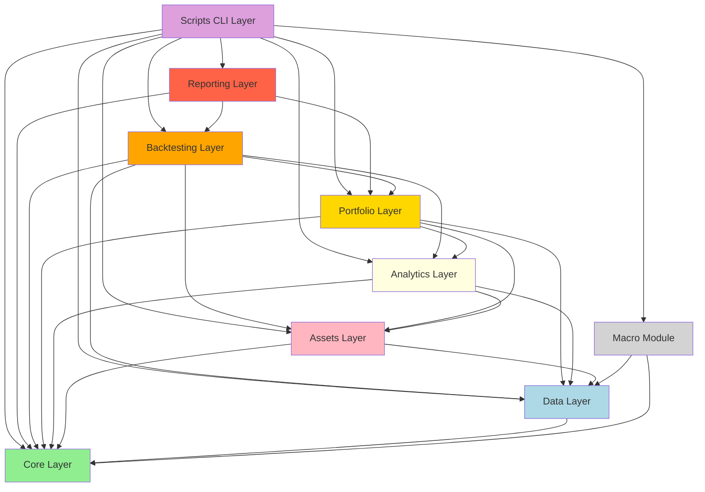

# Module Dependency Diagram

## Layered Architecture



## Dependency Rules

**Green (Core):** No dependencies
**Blue (Data):** Depends only on core
**Pink (Assets):** Depends on data, core
**Yellow (Analytics):** Depends on assets, data, core
**Gold (Portfolio):** Depends on analytics, assets, data, core
**Orange (Backtesting):** Depends on portfolio and below
**Red (Reporting):** Depends on backtesting, portfolio (top layer)
**Purple (Scripts):** Can depend on everything (orchestration)
**Gray (Macro):** Minimal dependencies (stub module)

## Key Constraints

1. **No circular dependencies** - Enforced by import-linter
2. **Lower layers don't depend on higher layers** - Enforced
3. **Core is self-contained** - Enforced
4. **Backtesting doesn't know about reporting** - Enforced

## Validation

```bash
lint-imports --config .importlinter
```
